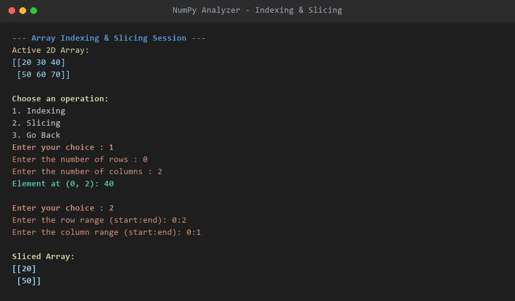
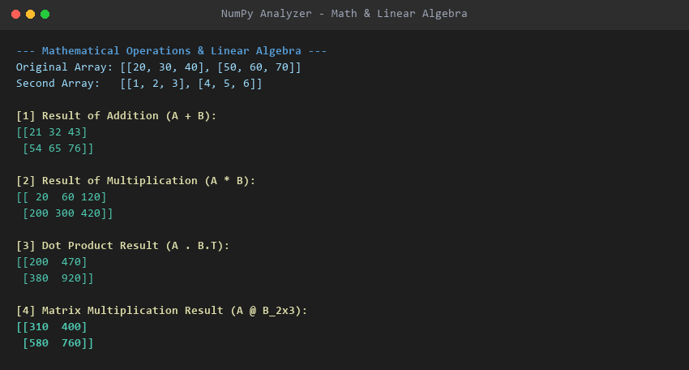
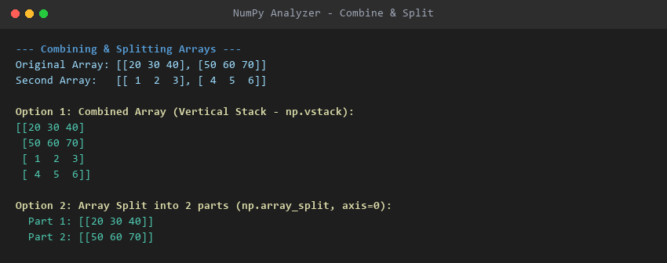
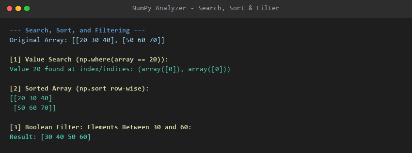
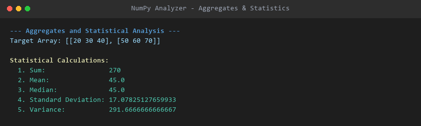

# NumPy Analyzer

An object-oriented, menu-driven Python application encapsulating multidimensional NumPy array operations, mathematical transformations, linear algebra, manipulation, and statistical computing.

---

## Table of Contents

- [Overview](#overview)
- [Class Architecture & Structure](#class-architecture--structure)
- [Tech Stack & Requirements](#tech-stack--requirements)
- [Getting Started](#getting-started)
- [Features & Operations Covered](#features--operations-covered)
- [Sample Usage & Real Output](#sample-usage--real-output)
  - [1. Array Creation](#1-array-creation)
  - [2. Indexing & Slicing](#2-indexing--slicing)
  - [3. Mathematical Operations & Linear Algebra](#3-mathematical-operations--linear-algebra)
  - [4. Combining & Splitting Arrays](#4-combining--splitting-arrays)
  - [5. Searching, Sorting & Filtering](#5-searching-sorting--filtering)
  - [6. Aggregates & Statistical Analysis](#6-aggregates--statistical-analysis)
- [Assumptions Made](#assumptions-made)
- [Project Structure](#project-structure)
- [Author](#author)
- [License](#license)

---

## Overview

**NumPy Analyzer** (`Numpy analyst`) is an interactive console-based analytical toolkit designed to perform core numerical computing workflows using NumPy. Built around the object-oriented `DataAnalytics` class, the application encapsulates multidimensional array creation (1D, 2D, and 3D), multidimensional slicing/indexing, element-wise arithmetic, linear algebra (dot products and matrix multiplication), array restructuring (concatenation, stacking, and splitting), conditional searching/filtering, and descriptive statistical aggregation.

---

## Class Architecture & Structure

The codebase is organized under the `DataAnalytics` class and executed via a menu-driven `main()` function.

### Class: `DataAnalytics`

| Component | Identifier | Scope / Type | Description |
| :--- | :--- | :--- | :--- |
| **Class Attribute** | `__name_toolkit` | Private (`"Numpy analyst"`) | Stores the internal toolkit name identifier. |
| **Instance Attribute** | `__array` | Private (`None` or `np.ndarray`) | Encapsulates the active multidimensional NumPy array. |
| **Constructor** | `__init__()` | Public Constructor | Initializes `self.__array` to `None`. |
| **Getter Property** | `@property array(self)` | Public Property | Returns the current private array `self.__array`. |
| **Setter Property** | `@array.setter array(self, value)` | Public Setter | Converts input sequences into a NumPy array and assigns to `self.__array`. |
| **Static Method** | `@staticmethod display()` | Public Static Method | Prints the toolkit welcome message without requiring class instantiation. |
| **Class Method** | `@classmethod create_from_range(cls, start, end, step=1)` | Factory Method | Alternative constructor instantiating `DataAnalytics` from a range using `np.arange()`. |
| **Helper Method** | `__check(self)` | Private Instance Method | Validates whether `self.__array` is initialized before executing downstream operations. |
| **Method** | `create_array(self)` | Public Instance Method | Prompts user for dimensions and elements to create 1D, 2D, or 3D NumPy arrays. |
| **Method** | `sli(self)` | Public Instance Method | Executes coordinate indexing and range slicing across 1D, 2D, and 3D arrays. |
| **Method** | `math(self)` | Public Instance Method | Performs element-wise arithmetic (`+`, `-`, `*`, `/`), dot products (`np.dot`), and matrix multiplication (`@`). |
| **Method** | `com_slp(self)` | Public Instance Method | Combines arrays (`np.concatenate`, `np.vstack`) or splits them into sub-arrays (`np.array_split`). |
| **Method** | `sea_sort(self)` | Public Instance Method | Performs value search (`np.where`), row-wise sorting (`np.sort`), and boolean conditional filtering. |
| **Method** | `ag_stat(self)` | Public Instance Method | Calculates descriptive statistics: Sum, Mean, Median, Standard Deviation, and Variance. |

### Driver: `main()`
- Implements a continuous interactive `while True` CLI loop providing structured menu navigation, input validation, and execution routing to the corresponding `DataAnalytics` methods.

---

## Tech Stack & Requirements

- **Programming Language**: Python 3.9+
- **Environment**: Jupyter Notebook / Python Console
- **Core Dependencies**:
  - `numpy` (v1.25+) - Numerical computations, multidimensional array structures, linear algebra, and statistical functions

---

## Getting Started

### 1. Clone the Repository
```bash
git clone https://github.com/rudhiyansh/numpy-analyzer.git
cd numpy-analyzer
```

### 2. Set Up Virtual Environment (Optional but Recommended)
```bash
python -m venv venv
# On Windows:
venv\Scripts\activate
# On macOS/Linux:
source venv/bin/activate
```

### 3. Install Requirements
```bash
pip install numpy notebook
```

### 4. Run the Application
You can run the application directly via Python terminal or through Jupyter Notebook:

**Running via Terminal:**
```bash
python -c "import json; nb=json.load(open('Numpy_Analyzer (1) (1).ipynb')); exec(''.join(nb['cells'][0]['source']))"
```

**Running via Jupyter Notebook:**
```bash
jupyter notebook "Numpy_Analyzer (1) (1).ipynb"
```
Run Cell 0 to launch the interactive analyzer menu.

---

## Features & Operations Covered

| Category | Operation | NumPy Functions / Logic | Implementation Location |
| :--- | :--- | :--- | :--- |
| **OOP Architecture** | Encapsulation & Properties | `__init__`, `__array`, `@property`, `@array.setter` | `DataAnalytics` Class Header |
| **Alternative Constructors** | Static & Class Methods | `@staticmethod display()`, `@classmethod create_from_range()` | `DataAnalytics` Class Header |
| **Array Creation** | 1D, 2D, and 3D Arrays | `np.array()`, `np.reshape(rows, cols)`, `np.reshape(depth, rows, cols)` | `create_array()` Method |
| **Coordinate Indexing** | 1D, 2D, and 3D Indexing | `array[ind]`, `array[row, col]`, `array[dep, row, col]` | `sli()` Method (Option 1) |
| **Range Slicing** | 1D and Multidimensional Slices | `array[start:end]`, `array[r_start:r_end, c_start:c_end]` | `sli()` Method (Option 2) |
| **Element-wise Arithmetic** | Addition, Subtraction, Multiplication, Division | `+`, `-`, `*`, `/` | `math()` Method (Options 1–4) |
| **Linear Algebra** | Dot Product & Matrix Multiplication | `np.dot(self.__array, second.T)`, `self.__array @ second` | `math()` Method (Options 5–6) |
| **Array Manipulation** | Concatenation & Vertical Stacking | `np.concatenate()`, `np.vstack()` | `com_slp()` Method (Option 1) |
| **Array Splitting** | Partitioning along axis 0 | `np.array_split(self.__array, n, axis=0)` | `com_slp()` Method (Option 2) |
| **Value Searching** | Index Location Search | `np.where(self.__array == value)` | `sea_sort()` Method (Option 1) |
| **Array Sorting** | Row-wise Array Sorting | `np.sort(self.__array)` | `sea_sort()` Method (Option 2) |
| **Boolean Filtering** | Relational & Range Conditions | `array[array > val]`, `array[(array >= low) & (array <= high)]` | `sea_sort()` Method (Option 3) |
| **Statistical Computations** | Sum, Mean, Median, Std Dev, Variance | `np.sum()`, `np.mean()`, `np.median()`, `np.std()`, `np.var()` | `ag_stat()` Method (Options 1–5) |

---

## Sample Usage & Real Output

### 1. Array Creation

Creating a 2D array of shape `(2, 3)`:
```text
Select the type of array to create:
1. 1D Array
2. 2D Array
3. 3D Array

Enter your choice : 2
Enter the number of rows : 2
Enter the number of columns : 3
Enter 6 elemnts for the array separated by space : 20 30 40 50 60 70

Array created successfully:
[[20 30 40]
 [50 60 70]]
```

---

### 2. Indexing & Slicing

Accessing element at `(0, 2)` and slicing sub-matrix `[0:2, 0:1]`:
```text
Choose an operation:
1. Indexing
2. Slicing
3. Go Back
Enter your choice : 1
Enter the number of rows : 0
Enter the number of columns : 2

Element at (0, 2): 40

Choose an operation:
1. Indexing
2. Slicing
3. Go Back
Enter your choice : 2
Enter the row range (start:end): 0:2
Enter the column range (start:end): 0:1

Sliced Array:
[[20]
 [50]]
```



---

### 3. Mathematical Operations & Linear Algebra

Given primary array `[[20, 30, 40], [50, 60, 70]]` and secondary matrix `[[1, 2, 3], [4, 5, 6]]`:

- **Addition**:
  ```text
  Result of Addition:
  [[21 32 43]
   [54 65 76]]
  ```
- **Multiplication (Element-wise)**:
  ```text
  Result of Multiplication:
  [[ 20  60 120]
   [200 300 420]]
  ```
- **Dot Product (`np.dot(A, B.T)`)**:
  ```text
  Dot Product Result:
  [[200 470]
   [380 920]]
  ```
- **Matrix Multiplication (`A @ B` with compatible `(3, 2)` matrix)**:
  ```text
  Matrix Multiplication Result:
  [[310 400]
   [580 760]]
  ```



---

### 4. Combining & Splitting Arrays

- **Vertical Stacking (`np.vstack`)**:
  ```text
  Combined Array (Vertical Stack):
  [[20 30 40]
   [50 60 70]
   [ 1  2  3]
   [ 4  5  6]]
  ```
- **Splitting (`np.array_split`, `n = 2`)**:
  ```text
  Array split into 2 parts:
    Part 1: [[20 30 40]]
    Part 2: [[50 60 70]]
  ```



---

### 5. Searching, Sorting & Filtering

- **Value Search (`np.where`)**:
  ```text
  Enter the value to search: 20
  Value 20 found at index/indices: (array([0]), array([0]))
  ```
- **Row-wise Sorting (`np.sort`)**:
  ```text
  Sorted Array:
  [[20 30 40]
   [50 60 70]]
  (Sorting applied row-wise.)
  ```
- **Boolean Filtering (`between 30 and 60`)**:
  ```text
  Elements between 30 and 60: [30 40 50 60]
  ```



---

### 6. Aggregates & Statistical Analysis

```text
Target Array:
[[20 30 40]
 [50 60 70]]

Statistical Calculations:
Sum:                270
Mean:               45.0
Median:             45.0
Standard Deviation: 17.07825127659933
Variance:           291.6666666666667
```



---

## Assumptions Made

- **Index Numbering**: Array indexing follows standard 0-based Python indexing conventions.
- **Input Data Types**: Array inputs parsed from CLI prompts are cast to standard integer types (`int`).
- **Matrix Multiplication Alignment**: For matrix multiplication (`@`), the second input matrix must satisfy the inner dimension condition `columns_1 == rows_2`.
- **Slicing Syntax**: Slice ranges are expected in standard `start:end` format, with empty entries defaulting to the beginning or end of the respective axis.

---

## Project Structure

```text
numpy-analyzer/
├── README.md
├── Numpy_Analyzer (1) (1).ipynb
└── screenshots/
    ├── aggregate_and_statistical_operations.png
    ├── array_indexing_and_slicing.png
    ├── combine_and_split_arrays.png
    ├── mathematical_and_matrix_operations.png
    ├── numpy_analyzer_hero_preview.png
    └── search_sort_filter_arrays.png
```

---

## Author

- **GitHub**: [@rudhiyansh](https://github.com/rudhiyansh)

---

## License

This project is open-source and available under the [MIT License](LICENSE).
